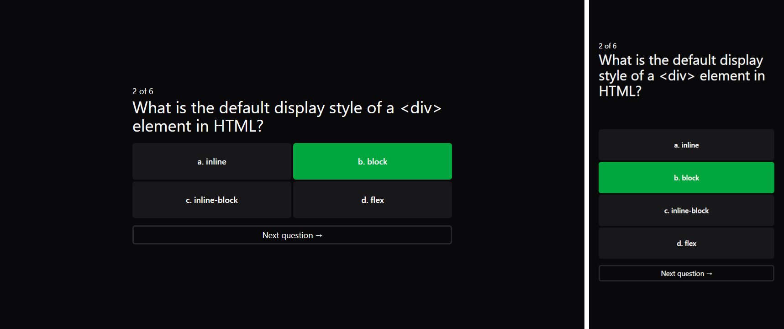
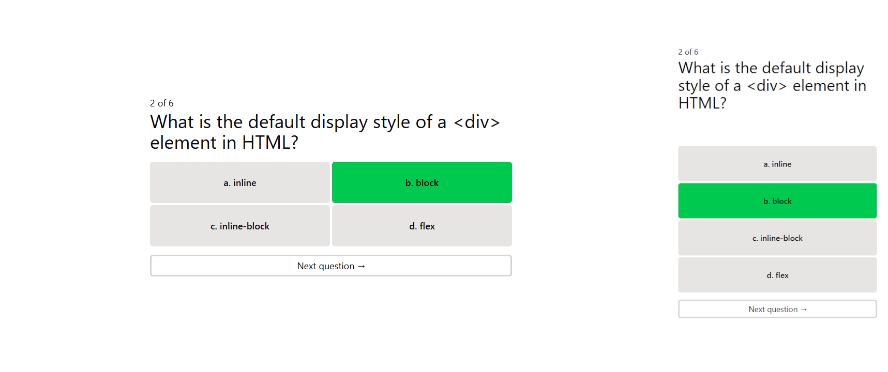

# ❓ Quiz app

This is a **MERN stack web application** that presents a single question with four possible answers. After completing the quiz, the user sees a summary with their results. The **site is fully responsive** and offers a clean, simple, and modern user interface

The frontend is built with React, TypeScript, and TailwindCSS, which together create a visually appealing and **user-friendly design** that works well on all devices. **Dark mode is automatically enabled based on the user's system preferences** to provide a comfortable viewing experience

On the backend, the app uses Node.js and Express.js, while data is securely stored and managed on an external MongoDB server, ensuring scalable and reliable performance

dark mode

light mode

## ⚙️ Technologies Used

  

## 💻 Features

- **TailwindCSS Design** - The design using TailwindCSS provides a nice, modern, and user-friendly interface that looks good on all devices

- **Simple Interface** - The app has a clean and simple design that works well on different devices, making it easy to use

- **Dark Mode** - Dark mode is automatically set based on the user's preferences, making it easier on the eyes

- **Score Counting and Summary** - After finishing the test, the score is automatically calculated and a summary is shown to help the user see their results

- **MongoDB Database** - Data is stored on an external server using MongoDB, which ensures safe and scalable data management

## 📄 License

The [MIT License](./LICENSE) (MIT). Please see License File for more information.

## 🔎 See Also

[GitHub profile](https://github.com/OKE225)
